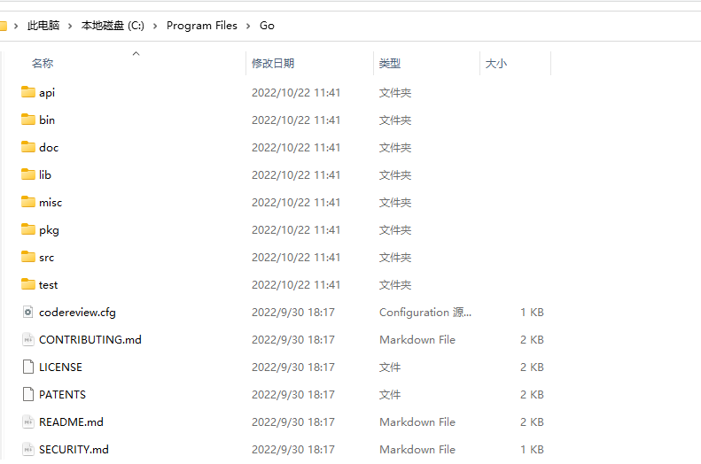

# Go语言概述

## 与C语言的区别

https://hyperpolyglot.org/c

## 工程结构

Go语言项目需要有特定的目录结构进行管理，一个标准的Go工程需要有以下三个目录

| 目录 | 用途         |
| ---- | ------------ |
| src  | 程序源代码   |
| bin  | 编译后的程序 |
| pkg  | 依赖包       |

我们使用GOPATH这个环境变量进行目录的指定 

## 新建工程

### GOPATH

首先我们在准备存放项目的位置新建好工程结构中提到的`src`，`bin`，`pkg`目录


目录的位置为

```
D:\GoProject\workSpace
```

我们需要将其添加至环境变量GOPATH中


### GOROOT

存放Go语言的标准库位置，即SDK的安装位置

> SDK下载 ： https://golang.google.cn/dl/

同样添加到环境变量中,我的sdk安装到了以下位置

```
C:\Program Files\Go
```

目录结构如下图所示



我们将其添加至环境变量中


此时两个环境变量均配置完成

## 使用GoLand添加项目

上面已经定义了GOPATH和GOROOT两个环境变量，我们可以打开Goland查看两个环境变量，在File->Setting->Go下可以查看


然后我们Open Project，直接打开我们已经新建好的`src`文件夹


## HelloWorld环境验证

在Goland中新建一个hello.go


写一个Hello world


此时如果出现报错

> 该版本的 %1 与你运行的 Windows 版本不兼容。请查看计算机的系统信息，然后联系软件发布者

需要将默认的

```go
package src
```

改为

```go
package main
```

就不会出现此问题了

运行结果如下


## HelloWorld详解

```go
package main

import "fmt"

func main() {
   fmt.Println("Hello world")
}
```

我们逐行分析

```go
package main
```

每个go文件都需要package来指定当前包

```go
import "fmt"
```

导入标准包fmt，fmt一般用于格式化IO

```go
func main() {
   fmt.Println("Hello world")
}
```

所有函数都需要使用func来定义,且代码块左括号必须与函数名同行

## Go语言特点

1. 没有头文件概念

2. 是强类型语言

3. 是编译型语言

4. 一个go语言的应用程序，运行时不需要依赖外部库，会将执行时需要的所有库都打包到程序中，同时也 带来了程序较大的情况

5. 如果Import的包在程序中没有使用，那么程序不允许编译

6. go语法不区分平台，在Windows/Linux/MacOS下一样，但是编译在其他平台上运行的程序需要通过两个环境变量来设置

   1. GOOS：设定运行的平台
      1. Mac:GOOS=darwain
      2. Linux:GOOS=linux
      3. Windows:GOOS=windows
   2. GOARCH：目标平台的架构体系
      1. 386:GOARCH=386
      2. Amd64: GOARCH=amd64
      3. arm：GOARCH=arm

   > 通过go env命令即可查看环境变量

## 配置GoLand终端为Shell

在File->Settings->Tools->Terminal中将Shell Path换为Bash的位置，既可以使用ls等命令，并且可以直接去设定GO环境变量的值，如GOOS=linux


## Go命令

### 编译文件

```bash
go build -o test Hello.go
```


### 直接运行

```bash
go run Hello.go
```


### 安装程序

```bash
go install
```

将编译的程序放入bin目录(需要配置GOBIN环境变量)


此时执行go install将会把编译好的文件放入gobin目录下，我们就可以直接在命令行下执行该命令了，

### 查看环境变量

```bash
go env
```

在设定了新的环境变量后需要重启Goland才会生效

# 基本语法

## 变量定义

```go
func main() {
	// 定义变量 var
	// 定义常量 const

	// 01-先定义变量再赋值
	// var [varname] [datatype]
	var age int
	var name string
	age = 3
	name = "Adian"
	// printf格式化输出或者println输出整行
	fmt.Println("name is", name, "and age is", age)
	fmt.Printf("name is %s and age is %d\n", name, age)

	// 02-定义时直接赋值，类型可以省略
	var gender = "man"
	fmt.Println("gender is", gender)

	// 03-定义直接赋值，自动识别类型
	height := 172.3
	fmt.Println("height is", height)

	// 04-平行赋值
	i, j := 10, 20
	fmt.Println("i=", i, "j=", j)
    // 可以使用这个特性实现函数值呼唤
    i,j = j,i

}
```

## 自增语法

和C一样的自增语法，但是只有

```go
i++
i--
```

注意没有++i这样的，同时自增语句必须单独一行

```go
func main() {
	i := 1
	i++
	fmt.Println("i =", i)
	i--
	fmt.Println("i =", i)
}
```

这里不可以像C一样在语句里自增，例如

```go
fmt.Println("i =", i++) // 完全错误
```

这样是完全错误的

## 指针

GO的指针不需要手动释放，因为有垃圾回收机制(GC,garbage collector)，C语言不可以返回栈上的指针，但是Go可以，程序在编译时就确定了变量的分配位置，编译的时候如果有必要的话，就将变量分配到堆上

```go
func main() {

	// C中指针访问结构体成员tree->next 在GO中只有tree.next

	// 01-直接申请指针
	name := "Lily"
	ptr := &name
	fmt.Println("name :", *ptr)
	fmt.Println("name ptr :", ptr)

	// 02-使用new关键字
	name2 := new(string)
	*name2 = "Bili"
	fmt.Println("name :", *name2)
	fmt.Println("name ptr :", name2)
}
```

得到结果

```
name : Lily
name ptr : 0xc000088220
name : Bili
name ptr : 0xc000088240
```

然后实现一下上述内容中的返回栈上的指针

```go
func testptr() *string {
	// 返回一个String类型的指针
	city := "北京"
	cityPtr := &city
	return cityPtr
}

func main() {
	res := testptr()
	fmt.Println("res is", *res)
}
```

在C语言中局部变量中的指针是绝不允许被返回的，因为在函数执行结束后内存已经被清理

```c
int *fun( )
{
	int a ;
	return &a; // 返回局部变量的地直，返回后这个变量已不存在了
}
```

这里解释一下，局部变量通常会被放到栈上，而全局变量通常会在堆上，go编译器会自动识别局部变量有没有被引用，如被引用则放到堆上

go语言中判断空指针并不是用null而是用nil

```go
if res == nil {
	fmt.Println("res 为空")
} else {
	fmt.Println("res 非空")
}
```

## 不支持的语法

1. 自增++i,--i
2. 地址加减
3. 三木运算符
4. 只有false才能代码逻辑假，0和nil都不可以(只能if false，不可以if nil /if 0  )

```go
func main() {
	--i
	++i
	if 0 {}
	if nil{}
	x = a>b?a:b
}
```

## 字符串

 Go语言没有.length方法，只能使用len()进行处理 

```go
func main() {
	// 01-定义
	name := "Adian\n"
	// 如果需要换行，则使用反引号``
	usage := `Hello
				I am a Usage
				Have fun`
	fmt.Println(name, usage)

	// 02-求长度以及访问
	length1 := len(usage)
	fmt.Println(length1)
	// 逐个输出
	for i := 0; i < len(name); i++ {
		fmt.Printf("i : %d , v ： %c\n", i, name[i])
	}

	// 03-拼接
	i, j := "Hello", "World"
	println("i+j = ", i+j)

}
```

## 数组

### 定长数组

```go
func main() {
	// 01-定义长度为10的数组
	nums1 := [10]int{1, 2, 3, 4, 5}
	var nums2 = [10]int{6, 7, 8, 9, 0}
	var nums3 [10]int = [10]int{1, 2, 3, 4}
	fmt.Println(nums1)
	fmt.Println(nums2)
	fmt.Println(nums3)

	// 02-访问和遍历
	// 逐个输出
	for i := 0; i < len(nums3); i++ {
		fmt.Printf("i : %d , v ： %d\n", i, nums3[i])
	}
	// 可以和Python一样for range
	// key是数组下标，value是值
	for key, value := range nums3 {
		fmt.Println("key : ", key, " value : ", value)
	}
	// 如果想忽略key或者value,可以使用_
	for _, value := range nums3 {
		fmt.Println("key : None", " value : ", value)
	}
	// 如果两个都忽略，则需不需要:
	for _, _ = range nums3 {
		fmt.Println("key : None", " value : ")
	}
    // 修改对应的内容
	nums1[1] = 999
	fmt.Println(nums1)
}
```

### 不定长数组

不定长数组通常被称为切片(slice)，切片的底层实现也是数组，但是可以动态改变长度

```go
func main() {
	// 01-不定长数组(切片slice)的定义
	// 定长数组
	names1 := [10]string{"北京", "上海", "广州", "深圳"}
	// 切片(不定长数组)
	names2 := []string{"北京", "上海", "广州"}
	fmt.Println(names1, names2)

	// 02-追加数据
	names2 = append(names2, "天津")
	fmt.Println(names2)

	// 02-切片不仅有len()长度，还有容量cap()的概念
	fmt.Println("names2 append之前长度len : ", len(names2), "容量cap : ", cap(names2))
	names2 = append(names2, "鹤岗")
	fmt.Println("names2 append之后长度len : ", len(names2), "容量cap : ", cap(names2))
}
```

得到len和容量的关系

```go
names2 append之前长度len :  4 容量cap :  6
names2 append之后长度len :  5 容量cap :  6
```

容量应该是初始分配的长度，我们用一个代码测试一下 

```go
func main() {
	// 03-容量申请测试
	testcap := []int{}
	for i := 0; i < 20; i++ {
		fmt.Println("testcap append之后长度len : ", len(testcap), "容量cap : ", cap(testcap))
		testcap = append(testcap, i)
	}
}
```

得到的结果如下

```
testcap append之后长度len :  0 容量cap :  0
testcap append之后长度len :  1 容量cap :  1
testcap append之后长度len :  2 容量cap :  2
testcap append之后长度len :  3 容量cap :  4
testcap append之后长度len :  4 容量cap :  4
testcap append之后长度len :  5 容量cap :  8
testcap append之后长度len :  6 容量cap :  8
testcap append之后长度len :  7 容量cap :  8
testcap append之后长度len :  8 容量cap :  8
testcap append之后长度len :  9 容量cap :  16
testcap append之后长度len :  10 容量cap :  16
testcap append之后长度len :  11 容量cap :  16
testcap append之后长度len :  12 容量cap :  16
testcap append之后长度len :  13 容量cap :  16
testcap append之后长度len :  14 容量cap :  16
testcap append之后长度len :  15 容量cap :  16
testcap append之后长度len :  16 容量cap :  16
testcap append之后长度len :  17 容量cap :  32
testcap append之后长度len :  18 容量cap :  32
testcap append之后长度len :  19 容量cap :  32
```

可见从0开始分配(如果有预设内容则从预设长度开始，比如原先有3个内容在切片中，则容量cap为3）每次超过容量长度则申请已有长度的二倍(在超过阈值之后就不会为2倍了)

在创建切片的时候，可以用make来指定容量cap的值

```go
func main() {
    // 创建容量20，长度为10的切片
	test_cap := make([]string, 10, 20)
	println("test_cap len :", len(test_cap), "cap :", cap(test_cap))
	
}
```

得到结果如下，这样可以优化内存开销，提升运行效率

```go
test_cap len : 10 cap : 20
```

如果做单纯的切片操作，示例代码如下

```go
func main() {
	city_all := [5]string{"北京", "上海", "广州", "天津", "唐山"}
	fmt.Println("city_all 初始定义: ", city_all)

	// 01-切片操作,取下标为0，1，2的加入新的数组city_1
	city_part_1 := city_all[0:3]
	fmt.Println("city_part_1 初始定义: ", city_part_1)

	// 02-修改切片中的值会改变原数组的值
	city_part_1[1] = "周杰伦"
	fmt.Println("city_all 修改后: ", city_all)
	fmt.Println("city_part_1 修改后 : ", city_part_1)
}
```

在02中得到的结果如下

```go
city_all 初始定义:  [北京 上海 广州 天津 唐山]
city_part_1 初始定义:  [北京 上海 广州]
city_all 修改后:  [北京 周杰伦 广州 天津 唐山]
city_part_1 修改后 :  [北京 周杰伦 广州]
```

> 不仅是数组可以进行切片，字符串也可以做此操作

如果想要让切片完全独立于原始的数组，可以使用copy来实现  

```go
// 04-切片独立于原数组,如果全部copy，则需要使用[:]将数组转为切片
	city_copy := make([]string, 3, 3)
	copy(city_copy, city_all[0:3])
	fmt.Println("city_copy :", city_copy)
```

## 字典

 字典是哈希表，因为是key==>value，key是经过hash运算的，使用map前一定要分配空间

  ```go
  func main() {
  	// 01-字典的定义
  	// 学号==>姓名
  	var idNames map[int]string // 此时map不可以直接使用
  	// 给map分配空间
  	idNames = make(map[int]string, 10) // 也可以不指定长度
  	// 赋值
  	idNames[0] = "BigB"
  	idNames[1] = "BigC"
  	// 直接输出
  	fmt.Println(idNames)
  	// 遍历输出
  	for key, value := range idNames {
  		println("key :", key, "value :", value)
  	}
  	// 定义时直接分配空间
  	idNames1 := make(map[int]string, 10)
  	println(idNames1)
  
  	// 02-key的存在性判断
  	// 再map中所有的key都是合法的，如果并不存在该key值，则返回nil,所以不能通过value来判断key的存在性
  	// 因为可能value本身就是0,nil,false这些值
  	value, ok := idNames[3]
  	if ok {
  		fmt.Println("存在value ：", value)
  	} else {
  		fmt.Println("不存在value")
  	}
  
  	// 03-通过key删除map中的元素
  	delete(idNames, 0)	
  }
  ```

## 函数

Go的函数可以返回多个返回值

