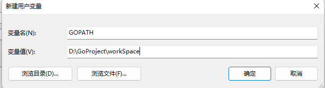

# Go语言概述

## 与C语言的区别

https://hyperpolyglot.org/c

## 工程结构

Go语言项目需要有特定的目录结构进行管理，一个标准的Go工程需要有以下三个目录

| 目录 | 用途         |
| ---- | ------------ |
| src  | 程序源代码   |
| bin  | 编译后的程序 |
| pkg  | 依赖包       |

我们使用GOPATH这个环境变量进行目录的指定 

## 新建工程

### GOPATH

首先我们在准备存放项目的位置新建好工程结构中提到的`src`，`bin`，`pkg`目录


目录的位置为

```
D:\GoProject\workSpace
```

我们需要将其添加至环境变量GOPATH中



### GOROOT

存放Go语言的标准库位置，即SDK的安装位置

> SDK下载 ： https://golang.google.cn/dl/

同样添加到环境变量中,我的sdk安装到了以下位置

```
C:\Program Files\Go
```

目录结构如下图所示


我们将其添加至环境变量中


此时两个环境变量均配置完成

## 使用GoLand添加项目

上面已经定义了GOPATH和GOROOT两个环境变量，我们可以打开Goland查看两个环境变量，在File->Setting->Go下可以查看


然后我们Open Project，直接打开我们已经新建好的`src`文件夹


## HelloWorld环境验证

在Goland中新建一个hello.go


写一个Hello world


此时如果出现报错

> 该版本的 %1 与你运行的 Windows 版本不兼容。请查看计算机的系统信息，然后联系软件发布者

需要将默认的

```go
package src
```

改为

```go
package main
```

就不会出现此问题了

运行结果如下


## HelloWorld详解

```go
package main

import "fmt"

func main() {
   fmt.Println("Hello world")
}
```

我们逐行分析

```go
package main
```

每个go文件都需要package来指定当前包

```go
import "fmt"
```

导入标准包fmt，fmt一般用于格式化IO

```go
func main() {
   fmt.Println("Hello world")
}
```

所有函数都需要使用func来定义,且代码块左括号必须与函数名同行

## Go语言特点

1. 没有头文件概念

2. 是强类型语言

3. 是编译型语言

4. 一个go语言的应用程序，运行时不需要依赖外部库，会将执行时需要的所有库都打包到程序中，同时也 带来了程序较大的情况

5. 如果Import的包在程序中没有使用，那么程序不允许编译

6. go语法不区分平台，在Windows/Linux/MacOS下一样，但是编译在其他平台上运行的程序需要通过两个环境变量来设置

   1. GOOS：设定运行的平台
      1. Mac:GOOS=darwain
      2. Linux:GOOS=linux
      3. Windows:GOOS=windows
   2. GOARCH：目标平台的架构体系
      1. 386:GOARCH=386
      2. Amd64: GOARCH=amd64
      3. arm：GOARCH=arm

   > 通过go env命令即可查看环境变量

## 配置GoLand终端为Shell

在File->Settings->Tools->Terminal中将Shell Path换为Bash的位置，既可以使用ls等命令，并且可以直接去设定GO环境变量的值，如GOOS=linux


## Go命令

### 编译文件

```bash
go build -o test Hello.go
```


### 直接运行

```bash
go run Hello.go
```


### 安装程序

```bash
go install
```

将编译的程序放入bin目录(需要配置GOBIN环境变量)


此时执行go install将会把编译好的文件放入gobin目录下，我们就可以直接在命令行下执行该命令了，

### 查看环境变量

```bash
go env
```

在设定了新的环境变量后需要重启Goland才会生效

# 基本语法

## 变量定义

```go
func main() {
	// 定义变量 var
	// 定义常量 const

	// 01-先定义变量再赋值
	// var [varname] [datatype]
	var age int
	var name string
	age = 3
	name = "Adian"
	// printf格式化输出或者println输出整行
	fmt.Println("name is", name, "and age is", age)
	fmt.Printf("name is %s and age is %d\n", name, age)

	// 02-定义时直接赋值，类型可以省略
	var gender = "man"
	fmt.Println("gender is", gender)

	// 03-定义直接赋值，自动识别类型
	height := 172.3
	fmt.Println("height is", height)

	// 04-平行赋值
	i, j := 10, 20
	fmt.Println("i=", i, "j=", j)
    // 可以使用这个特性实现函数值呼唤
    i,j = j,i

}
```

## 自增语法

和C一样的自增语法，但是只有

```go
i++
i--
```

注意没有++i这样的，同时自增语句必须单独一行

```go
func main() {
	i := 1
	i++
	fmt.Println("i =", i)
	i--
	fmt.Println("i =", i)
}
```

这里不可以像C一样在语句里自增，例如

```go
fmt.Println("i =", i++) // 完全错误
```

这样是完全错误的

## 指针

GO的指针不需要手动释放，因为有垃圾回收机制(GC,garbage collector)，C语言不可以返回栈上的指针，但是Go可以，程序在编译时就确定了变量的分配位置，编译的时候如果有必要的话，就将变量分配到堆上

```go
func main() {

	// C中指针访问结构体成员tree->next 在GO中只有tree.next

	// 01-直接申请指针
	name := "Lily"
	ptr := &name
	fmt.Println("name :", *ptr)
	fmt.Println("name ptr :", ptr)

	// 02-使用new关键字
	name2 := new(string)
	*name2 = "Bili"
	fmt.Println("name :", *name2)
	fmt.Println("name ptr :", name2)
}
```

得到结果

```
name : Lily
name ptr : 0xc000088220
name : Bili
name ptr : 0xc000088240
```

然后实现一下上述内容中的返回栈上的指针

```go
func testptr() *string {
	// 返回一个String类型的指针
	city := "北京"
	cityPtr := &city
	return cityPtr
}

func main() {
	res := testptr()
	fmt.Println("res is", *res)
}
```

在C语言中局部变量中的指针是绝不允许被返回的，因为在函数执行结束后内存已经被清理

```c
int *fun( )
{
	int a ;
	return &a; // 返回局部变量的地直，返回后这个变量已不存在了
}
```

这里解释一下，局部变量通常会被放到栈上，而全局变量通常会在堆上，go编译器会自动识别局部变量有没有被引用，如被引用则放到堆上

go语言中判断空指针并不是用null而是用nil

```go
if res == nil {
	fmt.Println("res 为空")
} else {
	fmt.Println("res 非空")
}
```

## 不支持的语法

1. 自增++i,--i
2. 地址加减
3. 三木运算符
4. 只有false才能代码逻辑假，0和nil都不可以(只能if false，不可以if nil /if 0  )

```go
func main() {
	--i
	++i
	if 0 {}
	if nil{}
	x = a>b?a:b
}
```

## 字符串

 Go语言没有.length方法，只能使用len()进行处理 

```go
func main() {
	// 01-定义
	name := "Adian\n"
	// 如果需要换行，则使用反引号``
	usage := `Hello
				I am a Usage
				Have fun`
	fmt.Println(name, usage)

	// 02-求长度以及访问
	length1 := len(usage)
	fmt.Println(length1)
	// 逐个输出
	for i := 0; i < len(name); i++ {
		fmt.Printf("i : %d , v ： %c\n", i, name[i])
	}

	// 03-拼接
	i, j := "Hello", "World"
	println("i+j = ", i+j)

}
```

## 数组

### 定长数组

```go
func main() {
	// 01-定义长度为10的数组
	nums1 := [10]int{1, 2, 3, 4, 5}
	var nums2 = [10]int{6, 7, 8, 9, 0}
	var nums3 [10]int = [10]int{1, 2, 3, 4}
	fmt.Println(nums1)
	fmt.Println(nums2)
	fmt.Println(nums3)

	// 02-访问和遍历
	// 逐个输出
	for i := 0; i < len(nums3); i++ {
		fmt.Printf("i : %d , v ： %d\n", i, nums3[i])
	}
	// 可以和Python一样for range
	// key是数组下标，value是值
	for key, value := range nums3 {
		fmt.Println("key : ", key, " value : ", value)
	}
	// 如果想忽略key或者value,可以使用_
	for _, value := range nums3 {
		fmt.Println("key : None", " value : ", value)
	}
	// 如果两个都忽略，则需不需要:
	for _, _ = range nums3 {
		fmt.Println("key : None", " value : ")
	}
    // 修改对应的内容
	nums1[1] = 999
	fmt.Println(nums1)
}
```

### 不定长数组

不定长数组通常被称为切片(slice)，切片的底层实现也是数组，但是可以动态改变长度

```go
func main() {
	// 01-不定长数组(切片slice)的定义
	// 定长数组
	names1 := [10]string{"北京", "上海", "广州", "深圳"}
	// 切片(不定长数组)
	names2 := []string{"北京", "上海", "广州"}
	fmt.Println(names1, names2)

	// 02-追加数据
	names2 = append(names2, "天津")
	fmt.Println(names2)

	// 02-切片不仅有len()长度，还有容量cap()的概念
	fmt.Println("names2 append之前长度len : ", len(names2), "容量cap : ", cap(names2))
	names2 = append(names2, "鹤岗")
	fmt.Println("names2 append之后长度len : ", len(names2), "容量cap : ", cap(names2))
}
```

得到len和容量的关系

```go
names2 append之前长度len :  4 容量cap :  6
names2 append之后长度len :  5 容量cap :  6
```

容量应该是初始分配的长度，我们用一个代码测试一下 

```go
func main() {
	// 03-容量申请测试
	testcap := []int{}
	for i := 0; i < 20; i++ {
		fmt.Println("testcap append之后长度len : ", len(testcap), "容量cap : ", cap(testcap))
		testcap = append(testcap, i)
	}
}
```

得到的结果如下

```
testcap append之后长度len :  0 容量cap :  0
testcap append之后长度len :  1 容量cap :  1
testcap append之后长度len :  2 容量cap :  2
testcap append之后长度len :  3 容量cap :  4
testcap append之后长度len :  4 容量cap :  4
testcap append之后长度len :  5 容量cap :  8
testcap append之后长度len :  6 容量cap :  8
testcap append之后长度len :  7 容量cap :  8
testcap append之后长度len :  8 容量cap :  8
testcap append之后长度len :  9 容量cap :  16
testcap append之后长度len :  10 容量cap :  16
testcap append之后长度len :  11 容量cap :  16
testcap append之后长度len :  12 容量cap :  16
testcap append之后长度len :  13 容量cap :  16
testcap append之后长度len :  14 容量cap :  16
testcap append之后长度len :  15 容量cap :  16
testcap append之后长度len :  16 容量cap :  16
testcap append之后长度len :  17 容量cap :  32
testcap append之后长度len :  18 容量cap :  32
testcap append之后长度len :  19 容量cap :  32
```

可见从0开始分配(如果有预设内容则从预设长度开始，比如原先有3个内容在切片中，则容量cap为3）每次超过容量长度则申请已有长度的二倍(在超过阈值之后就不会为2倍了)

在创建切片的时候，可以用make来指定容量cap的值

```go
func main() {
    // 创建容量20，长度为10的切片
	test_cap := make([]string, 10, 20)
	println("test_cap len :", len(test_cap), "cap :", cap(test_cap))
	
}
```

得到结果如下，这样可以优化内存开销，提升运行效率

```go
test_cap len : 10 cap : 20
```

如果做单纯的切片操作，示例代码如下

```go
func main() {
	city_all := [5]string{"北京", "上海", "广州", "天津", "唐山"}
	fmt.Println("city_all 初始定义: ", city_all)

	// 01-切片操作,取下标为0，1，2的加入新的数组city_1
	city_part_1 := city_all[0:3]
	fmt.Println("city_part_1 初始定义: ", city_part_1)

	// 02-修改切片中的值会改变原数组的值
	city_part_1[1] = "周杰伦"
	fmt.Println("city_all 修改后: ", city_all)
	fmt.Println("city_part_1 修改后 : ", city_part_1)
}
```

在02中得到的结果如下

```go
city_all 初始定义:  [北京 上海 广州 天津 唐山]
city_part_1 初始定义:  [北京 上海 广州]
city_all 修改后:  [北京 周杰伦 广州 天津 唐山]
city_part_1 修改后 :  [北京 周杰伦 广州]
```

> 不仅是数组可以进行切片，字符串也可以做此操作

如果想要让切片完全独立于原始的数组，可以使用copy来实现  

```go
// 04-切片独立于原数组,如果全部copy，则需要使用[:]将数组转为切片
	city_copy := make([]string, 3, 3)
	copy(city_copy, city_all[0:3])
	fmt.Println("city_copy :", city_copy)
```

## 字典

 字典是哈希表，因为是key==>value，key是经过hash运算的，使用map前一定要分配空间

  ```go
  func main() {
  	// 01-字典的定义
  	// 学号==>姓名
  	var idNames map[int]string // 此时map不可以直接使用
  	// 给map分配空间
  	idNames = make(map[int]string, 10) // 也可以不指定长度
  	// 赋值
  	idNames[0] = "BigB"
  	idNames[1] = "BigC"
  	// 直接输出
  	fmt.Println(idNames)
  	// 遍历输出
  	for key, value := range idNames {
  		println("key :", key, "value :", value)
  	}
  	// 定义时直接分配空间
  	idNames1 := make(map[int]string, 10)
  	println(idNames1)
  
  	// 02-key的存在性判断
  	// 再map中所有的key都是合法的，如果并不存在该key值，则返回nil,所以不能通过value来判断key的存在性
  	// 因为可能value本身就是0,nil,false这些值
  	value, ok := idNames[3]
  	if ok {
  		fmt.Println("存在value ：", value)
  	} else {
  		fmt.Println("不存在value")
  	}
  
  	// 03-通过key删除map中的元素
  	delete(idNames, 0)	
  }
  ```

## 函数

Go的函数可以返回多个返回值，同时还可以指定返回参数的名字直接return

```go
func test(a int, b int) (sum int, str string) {
	// 直接把返回变量的变量名指定
	sum = a + b
	str = "hello"
	return
}

func test1(a int, b int) (int, string) {
	// 多返回值
	return a + b, "hello"
}

func test2(a int, b int) int {
	// 单返回值
	return a
}
func test3(a, b int) int {
	// 省略变量类型
	return a
}
```

## 内存逃逸
**什么叫内存逃逸**
	首先go的变量要不在栈上要不在堆上，栈上的变量会在函数销毁的时候就释放了，堆上的就要靠gc算法来了，我们一般说从栈逃逸到堆上或者一开始直接就在堆上的变量内存叫做内存逃逸

以下为一个实例代码

```go
package main

import "fmt"

func testPtr() *string {
	// 返回一个String类型的指针
	city := "北京"
	cityPtr := &city
	return cityPtr
}

func main() {
	p1 := testPtr()
	fmt.Println("p1 :", *p1)
}
```

我们将其build出来，并使用--gcflags来查看垃圾回收机制的细节

```go
go build -o test --gcflags "-m -m -l" 11-memory_escape.go 
```

结果如下

```
# command-line-arguments
./11-memory_escape.go:7:2: city escapes to heap:
./11-memory_escape.go:7:2:   flow: cityPtr = &city:
./11-memory_escape.go:7:2:     from &city (address-of) at ./11-memory_escape.go:8:13
./11-memory_escape.go:7:2:     from cityPtr := &city (assign) at ./11-memory_escape.go:8:10
./11-memory_escape.go:7:2:   flow: ~r0 = cityPtr:
./11-memory_escape.go:7:2:     from return cityPtr (return) at ./11-memory_escape.go:9:2
./11-memory_escape.go:7:2: moved to heap: city
./11-memory_escape.go:14:22: *p1 escapes to heap:
./11-memory_escape.go:14:22:   flow: {storage for ... argument} = &{storage for *p1}:
./11-memory_escape.go:14:22:     from *p1 (spill) at ./11-memory_escape.go:14:22
./11-memory_escape.go:14:22:     from ... argument (slice-literal-element) at ./11-memory_escape.go:14:13
./11-memory_escape.go:14:22:   flow: {heap} = {storage for ... argument}:
./11-memory_escape.go:14:22:     from ... argument (spill) at ./11-memory_escape.go:14:13
./11-memory_escape.go:14:22:     from fmt.Println(... argument...) (call parameter) at ./11-memory_escape.go:14:13
./11-memory_escape.go:14:14: "p1 :" escapes to heap:
./11-memory_escape.go:14:14:   flow: {storage for ... argument} = &{storage for "p1 :"}:
./11-memory_escape.go:14:14:     from "p1 :" (spill) at ./11-memory_escape.go:14:14
./11-memory_escape.go:14:14:     from ... argument (slice-literal-element) at ./11-memory_escape.go:14:13
./11-memory_escape.go:14:14:   flow: {heap} = {storage for ... argument}:
./11-memory_escape.go:14:14:     from ... argument (spill) at ./11-memory_escape.go:14:13
./11-memory_escape.go:14:14:     from fmt.Println(... argument...) (call parameter) at ./11-memory_escape.go:14:13
./11-memory_escape.go:14:13: ... argument does not escape
./11-memory_escape.go:14:14: "p1 :" escapes to heap
./11-memory_escape.go:14:22: *p1 escapes to heap
```

可以看到p1逃逸到了heap也就是堆上，详情可以参考https://zhuanlan.zhihu.com/p/441593663

## import

以加减法计算器为例，新建以下目录结构


add.go

```go
package add

func Add(a, b int) int {
	return a + b
}
```

sub.go

```go
package sub

func Sub(a, b int) int {
	return a - b
}
```

我们在main.go中可以使用如下方法使用Add和Sub函数

```go
package main

import (
	"fmt"
	"importTest/sub" // sub是文件名，也是包名
)

func main() {
	res := sub.Sub(20, 7)
	fmt.Println("sub.Sub(5,2) = ", res)
}
```

这里我实际上遇到了问题，在导入sub包的时候，出现了相对路径无法使用的问题，经过排查发现go编译器在goroot中寻找了该包，自然是无法寻找到的，解决方案是关闭goland中的go module选项并关闭go mod，问题得到了解决

若包名太长，可以给其定义一个别名

```GO
import (
	"fmt"
	SUB "importTest/sub"
)

func main() {
	res := SUB.Sub(20, 7)
	fmt.Println("sub.Sub(5,2) = ", res)
}
```

也可以直接使用`.`来直接使用包下的函数，不需要使用包名，不建议使用，因为可能出现多个包有相同函数的情况

```go
import (
	"fmt"
	. "importTest/sub"
)

func main() {
	res := Sub(20, 7)
	fmt.Println("sub.Sub(5,2) = ", res)
}
```

这里还有一个很重要的问题，便是**如果add.go中的函数如果不是`Add()`而是`add()`,是无法被调用的，因为在go中如果一个包中的函数想要被外部访问，首字母必须大写，类似于声明public**

接下来我们还可以在sub目录下新建一个utils.go，在其中新建test函数


test.go

```go
package sub

import "fmt"

func test() {
	fmt.Println("this is test() in sub/utils")
}
```

由于utils.go和sub.go在同一个包名下，在sub中可以不import直接使用utils的test方法

```go
package sub

func Sub(a, b int) int {
	test()
	return a - b
}
```

并且可以发现在同一个包下，不需要首字母大写来声明public

**同时需要注意，在go中，同级目录下只能有一个package name**，同时结合上述在同一包名下可以不用import，可以推导出在同一包名下，也可以说同一级目录下，不允许出现相同的函数名称

# 补充语法

## switch

### 命令行交互

在c语言中使用argc和**argv进行命令行参数的接收，在go中使用os.Args接收参数，是一个字符串切片

```go
func main() {
	cmds := os.Args
	for key, cmd := range cmds {
		fmt.Println("key :", key, " cmd :", cmd)
	}
}
```

结果如下

```go
$ go run 12-switch.go 12 haha eee
key : 0  cmd : /var/folders/j3/2vnn8qz93qj7snlvgdsrqd2m0000gn/T/go-build2748695938/b001/exe/12-switch
key : 1  cmd : 12
key : 2  cmd : haha
key : 3  cmd : eee
```

接下来我们使用switch来判断输入的参数并进行相对应的操作

```go
func main() {
	cmds := os.Args
	switch cmds[1] {
	case "help":
		fmt.Println("help info")
	case "test":
		fmt.Println("test info")
	default:
		fmt.Println("default info")
	}
}
```

在go的switch中，不需要进行break，如果想像c语言一样实现向下运行，可以使用fallthrough

```go
func main() {
	cmds := os.Args
	switch cmds[1] {
	case "help":
		fmt.Println("help info")
	case "test":
		fmt.Println("test info")
    fallthrough
	default:
		fmt.Println("default info")
	}
}
```

## 标签与continue-goto-break配合

### goto

在goto中，回到label1后i会从0重新开始

```go
func main() {
	// goto LABEL_1
	// break LABEL_2
	// continue LABEL_3
Label1:
	for i := 0; i < 5; i++ {
		for j := 0; j < 5; j++ {
			if j == 3 {
				goto Label1
			}
			fmt.Println("i = ", i, "j = ", j)
		}
	}
}
```

结果如下

```
i =  0 j =  0
i =  0 j =  1
i =  0 j =  2
i =  0 j =  0
i =  0 j =  1
i =  0 j =  2
```

### continue

 continue 一个标签则可以继续使用上一次的值

```go
func main() {
	// goto LABEL_1
	// break LABEL_2
	// continue LABEL_3
Label1:
	for i := 0; i < 5; i++ {
		for j := 0; j < 5; j++ {
			if j == 3 {
				continue Label1
			}
			fmt.Println("i = ", i, "j = ", j)
		}
	}
}
```

结果如下

```
i =  0 j =  0
i =  0 j =  1
i =  0 j =  2
i =  1 j =  0
i =  1 j =  1
i =  1 j =  2
i =  2 j =  0
i =  2 j =  1
i =  2 j =  2
i =  3 j =  0
i =  3 j =  1
```

### break

break label可以直接跳出双层循环，如果单纯的break只能跳出内层循环，然后继续外层循环，和上面的continue label一样

```go
func main() {
   // goto LABEL_1
   // break LABEL_2
   // continue LABEL_3
Label1:
   for i := 0; i < 5; i++ {
      for j := 0; j < 5; j++ {
         if j == 3 {
            break Label1
         }
         fmt.Println("i = ", i, "j = ", j)
      }
   }
}
```

结果：

```
i =  0 j =  0
i =  0 j =  1
i =  0 j =  2
```

## 枚举

### iota

go语言中没有枚举类型，但是我们可以使用`const` + `iota`（常量累加器进行模拟）const属于预编译期的赋值，因此不需要使用`:=`

iota是常量组计数器，每换一行则会递增1，如果常量组不赋值，默认与上一行取同一值。

如果同一行出现两个iota，iota的值不变

代码如下

```go
package main

import "fmt"

// 定义常量,模拟一周的枚举
const (
	Monday = iota
	Tuesday
	Wednesday
	Thursday
	Friday
	SateDay
	Sunday
)

func main() {
	fmt.Println(Monday)
	fmt.Println(Tuesday)
	fmt.Println(Wednesday)
	fmt.Println(Thursday)
	fmt.Println(Friday)
	fmt.Println(SateDay)
	fmt.Println(Sunday)

}

```

可以看到输出结果如下

```
0
1
2
3
4
5
6
```

如果同一行出现两个iota

```go
const (
	M,N = iota,iota
)
```

则M,N的值相同

不过每个iota是独立的，若再次遇到const，iota会重置为0

## 结构体

在go语言中，用结构体来模拟类,且有和c语言`typedef`功能相同的`type`

```go
type MyInt int
```

go语言的结构体使用type + struct来定义

```go
type People struct {
	name string
	age  int
}
```

可按照如下方式使用

```go
func main() {
	bob := People{age: 15, name: "bob"}
	fmt.Println("his name :", bob.name, "\nhis age :", bob.age)
}
```

哪怕使用内存地址，也不需要像C一样使用`->`，直接用`.`即可
